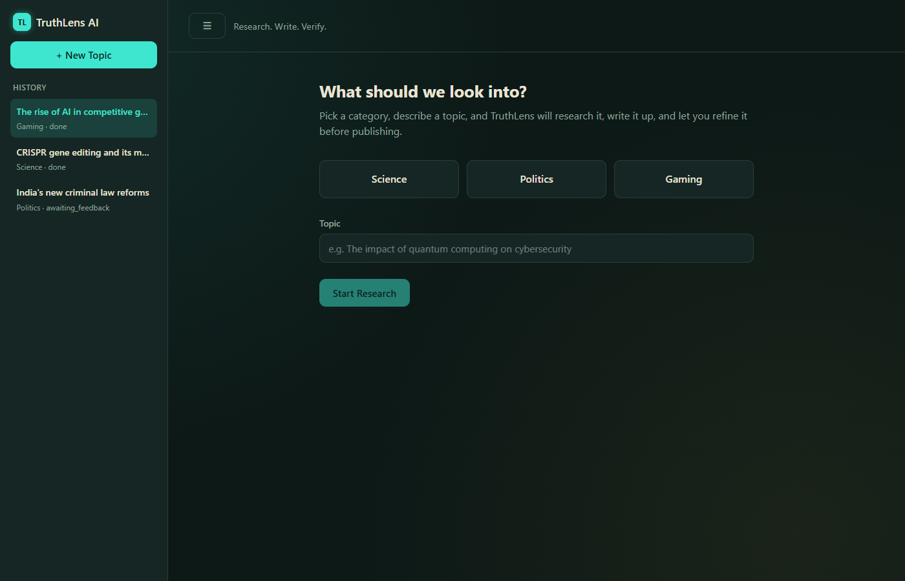
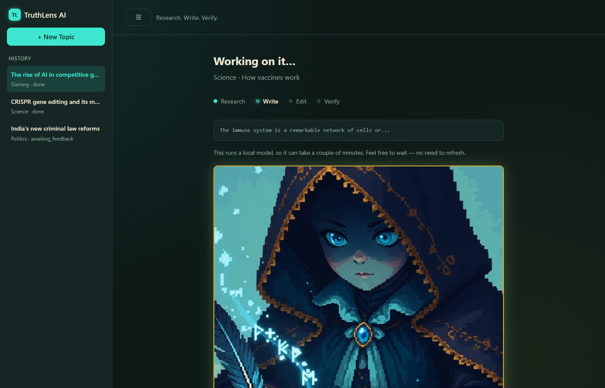

# TruthLens AI

A local, free, multi-agent pipeline that researches a topic, writes a blog post about it, fact-checks itself, and lets you refine the result through feedback — all running on your own machine with **zero API keys and zero cost**.

Three agents built on [LangGraph](https://langchain-ai.github.io/langgraph/) hand off a topic between them:

**Researcher** → **Writer** → **Editor** → **Grounding Check** → **you**

and then loop on your feedback until you approve.





## Why it's different

- **Actually free, not "free tier."** The LLM is [Ollama](https://ollama.com) running locally (no API key, no rate limit, no bill) and web search is DuckDuckGo via `ddgs` (no API key, no quota).
- **Fact-checks its own output.** After editing, a dedicated grounding-check pass flags specific claims — numbers, dates, quotes, names — that the research doesn't actually support, so you're not just trusting the model.
- **Two ways in.** A polished interactive CLI, and a browser UI with live token streaming, a themed loading animation per phase, run history, and one-click retry if a phase fails.
- **Human-in-the-loop by design.** Approve, ask for a re-research from scratch, or give free-text feedback — it's automatically routed to whichever agent (writer or editor) is actually relevant.

## Quick start

**Prerequisites:** Python 3.10+, and [Ollama](https://ollama.com/download) installed.

```bash
# 1. Set up a virtual environment
python -m venv .venv
.venv\Scripts\activate          # Windows
# source .venv/bin/activate     # macOS/Linux

# 2. Install dependencies
pip install -r requirements.txt   # includes pytest

# 3. Start Ollama and pull the model (one-time, ~4.7GB)
ollama serve
ollama pull llama3.1:8b
```

Then run either interface:

```bash
# Interactive terminal CLI
python main.py

# Browser UI at http://127.0.0.1:8000
python server.py
```

That's it — no `.env` file is required. Only add one if your Ollama isn't on the default `localhost:11434`, or you want to change the log level (see Configuration below).

If Ollama isn't running or the model isn't pulled, both entry points fail fast with the exact command you need to run.

## How it works

1. **Research** — runs four DuckDuckGo queries per topic, deduplicates results, and has the LLM synthesize them into a structured summary.
2. **Write** — turns the research into a category-specific blog draft (Science / Politics / Gaming, each with its own tone and audience).
3. **Edit** — fact-checks the draft against the research, tightens structure, removes repetition, and polishes tone.
4. **Grounding check** — a second pass that specifically hunts for claims the research doesn't back up, so hallucinated specifics don't slip through unnoticed.
5. **Your turn** — approve it, ask for full re-research, or describe what to change. Feedback is routed to the writer or editor automatically based on what you're asking for, then it loops back to step 4.

Every run — the research, both drafts, the grounding notes, sources, and how many revisions it took — is saved to a local SQLite history, browsable from the sidebar in the web UI or via `GET /api/history`.

## Project layout

```
main.py              interactive CLI entry point
server.py            FastAPI web UI (streaming, retry, history)
config.py            all tunable settings (model, context window, search, etc.)
state.py             the shared state object every agent reads/writes
agents/               ResearcherAgent, WriterAgent, EditorAgent
graph/workflow.py     the two LangGraph pipelines (initial run + revisions)
prompts/              category-specific system prompts per agent
utils/                retry/backoff, response parsing, feedback routing, SQLite storage
static/               the web UI (HTML/CSS/JS, no framework, no build step)
tests/                pytest suite - fully mocked, no Ollama/network needed
```

For the full technical breakdown (why things are structured this way, what's load-bearing, what to touch when adding a category), see [CLAUDE.md](CLAUDE.md).

## Testing

```bash
pytest                              # full suite, mocked, runs in well under a second
pytest tests/test_agents.py -v      # one file
pytest -k determine_revision_target # one test
```

No test depends on Ollama or a network connection.

## Configuration

Everything tunable lives in `config.py` — model name, temperature per agent, context window, search retry/backoff behavior, max revision iterations, and the SQLite history path. The only environment variables are `OLLAMA_BASE_URL` (default `http://localhost:11434`) and `LOG_LEVEL` (default `INFO`) — set them in a `.env` file if you need to override either.

Science, Politics, and Gaming are the three built-in categories. Adding a new one means touching the `Category` enum in `config.py`, the three `prompts/*.py` files, `WriterAgent.AUDIENCES`, and `main.py`'s example topics — see CLAUDE.md for details.
