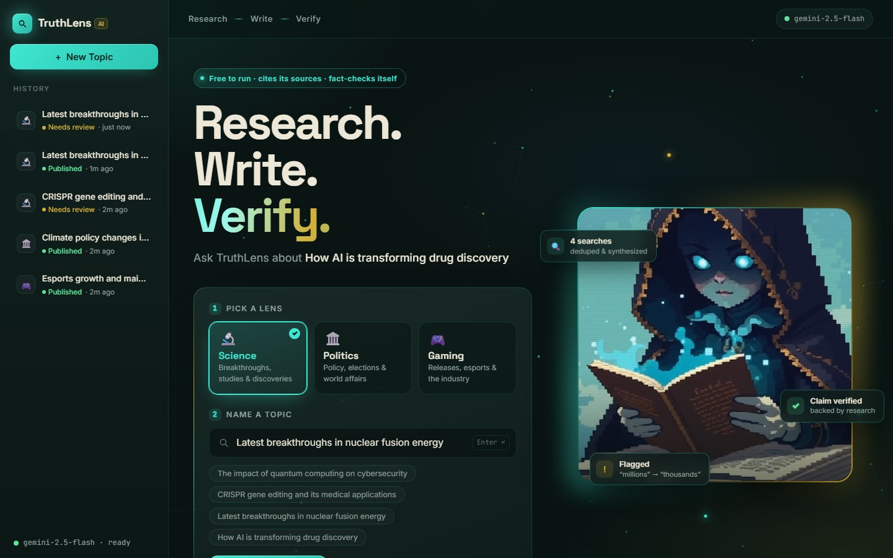
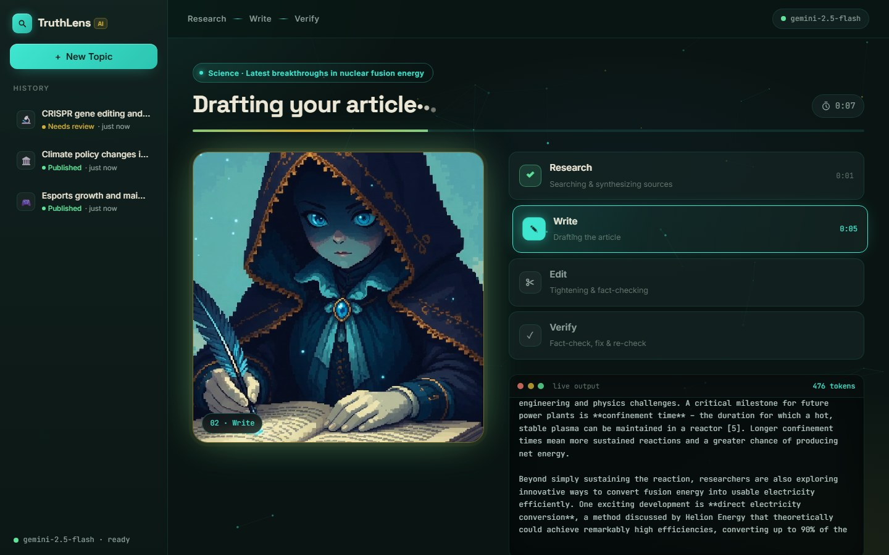
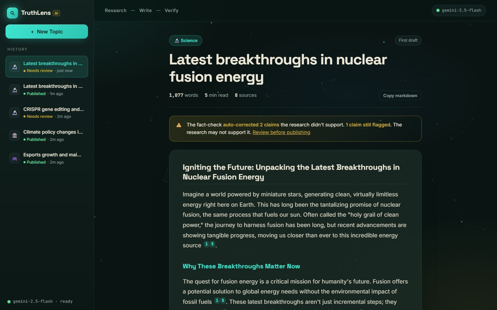
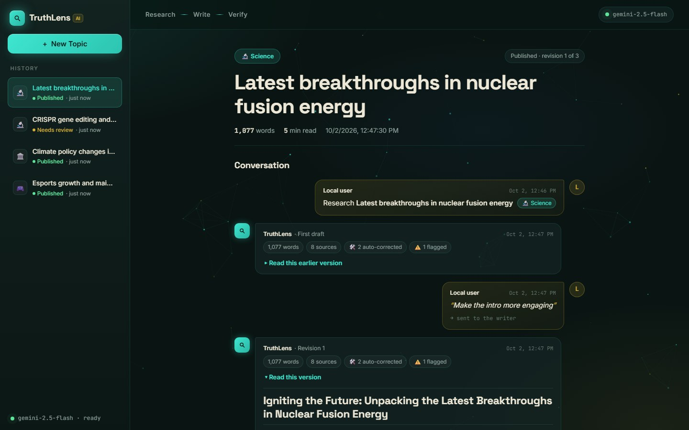
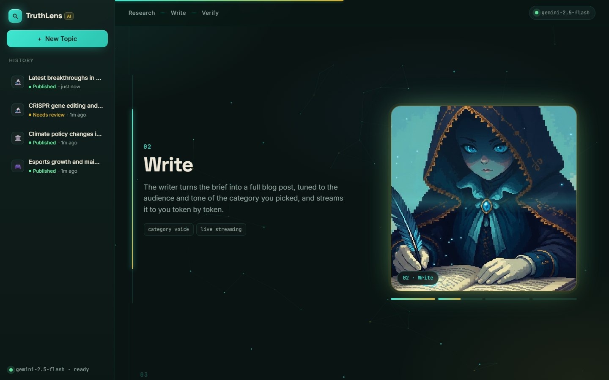
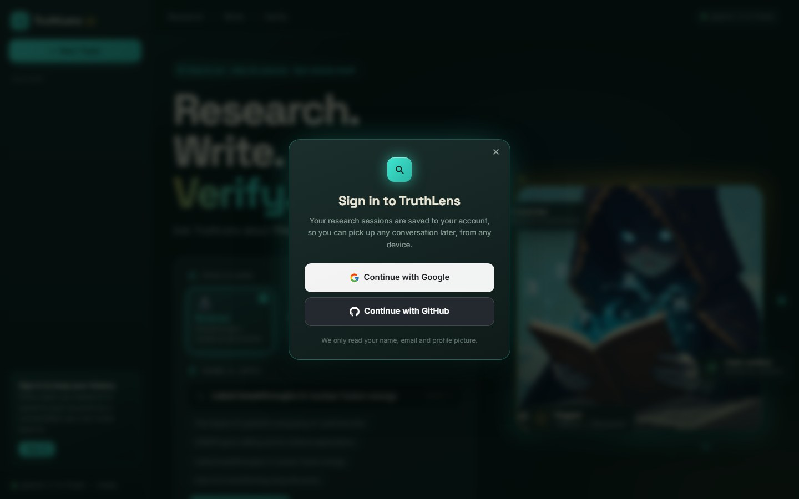

# 🔍 TruthLens AI

**Research. Write. Verify.**

TruthLens is a multi-agent AI writer that researches any topic on the live web, writes a blog post with every fact cited, fact-checks its own claims and fixes what it got wrong, then refines the post with you until you approve it.

It's free to run: use a local [Ollama](https://ollama.com) model or a free hosted one (Google Gemini, Groq), with DuckDuckGo for search.



---

## ✨ Highlights

- **Reads the real web, not just search snippets.** Four searches per topic from different angles, deduplicated, and the full article text of the top pages is read and synthesized into a research brief.
- **Cites its sources.** Specific facts carry `[1]`, `[2]`… markers that link to the exact page they came from. Citations to sources that don't exist are stripped automatically.
- **Fact-checks and fixes itself.** A grounding check hunts for numbers, dates, names and quotes the research doesn't support. The editor corrects or removes them and the post is checked again. You see exactly what was auto-corrected and anything still flagged.
- **You stay in charge.** Approve, re-research from scratch, or describe changes in plain words. Style requests go to the writer, polish requests to the editor.
- **Your history is a conversation.** Every session is saved as a thread (topic, each draft, your feedback, the approval), with every earlier version still readable. With Google or GitHub sign-in, each person sees only their own history.
- **Watch it think.** Each phase streams live, and a failed phase can be retried without starting over.

## 📸 A quick tour

| Live progress | Cited, fact-checked result |
|:---:|:---:|
|  |  |
| **Your sessions as conversations** | **Scroll-driven "How it works"** |
|  |  |

## 🧠 How it works

```
 Researcher ──► Writer ──► Editor ──► Fact-check ──► You
                                        │    ▲         │
                                        ▼    │         │ feedback
                                       Auto-fix        ▼
                                                 Writer or Editor
```

1. **Research.** Runs four DuckDuckGo searches, reads the full text of the top pages, and synthesizes a structured brief with numbered sources.
2. **Write.** Turns the brief into a blog post in the voice of the category you picked (Science, Politics or Gaming), citing facts inline.
3. **Edit.** Tightens structure, removes repetition, and checks the draft against the research.
4. **Fact-check and fix.** Flags claims the research doesn't support, has the editor correct just those, and checks again. Anything still flagged is shown to you rather than silently published.
5. **Your turn.** Approve it, ask for a fresh round of research, or describe what to change. Feedback is routed to the right agent automatically and the loop repeats (up to 3 revisions).

Built with [LangGraph](https://langchain-ai.github.io/langgraph/) and FastAPI. The web UI is plain HTML/CSS/JS with no build step, and there's also an interactive terminal CLI.

## 🚀 Run it on your computer

**You need:** Python 3.10+ and **one** of these:
- a free **Gemini API key** from [Google AI Studio](https://aistudio.google.com/apikey) (no download needed), or
- [Ollama](https://ollama.com/download) installed (fully offline model, about 4.7 GB download).

**1. Install**

```bash
python -m venv .venv
.venv\Scripts\activate            # Windows
# source .venv/bin/activate       # macOS / Linux
pip install -r requirements.txt
```

**2. Choose a model.** Create a file called `.env` in the project folder:

```bash
# Option A - Gemini (free hosted model)
LLM_PROVIDER=gemini
LLM_API_KEY=your-gemini-key
```

or, for Option B, leave `.env` empty and run Ollama:

```bash
ollama serve
ollama pull llama3.1:8b
```

`.env` is listed in `.gitignore`, so your key never gets committed.

**3. Start it**

```bash
python server.py     # web app - open the address printed in the terminal
python main.py       # or the interactive terminal version
```

If the model isn't reachable or the key is wrong, both tell you exactly what to fix.

## ⚙️ Configuration

Everything is optional. With nothing set, TruthLens uses local Ollama, saves history to a local SQLite file, and needs no sign-in. Put settings in `.env` when running locally, or in your host's secrets when deployed.

### Model

| Variable | Default | What it does |
|---|---|---|
| `LLM_PROVIDER` | `ollama` | `ollama` (local), `gemini`, `groq`, or `openai_compatible` (any other OpenAI-style API) |
| `LLM_API_KEY` | — | API key for a hosted provider |
| `LLM_MODEL` | provider preset | Override the model, e.g. `gemini-2.5-flash` |
| `LLM_BASE_URL` | provider preset | API address (required for `openai_compatible`) |
| `LLM_MAX_TOKENS` | provider preset | Maximum length of each reply |
| `LLM_REASONING_EFFORT` | `low` for presets | How much the model "thinks" before answering |
| `OLLAMA_BASE_URL` | Ollama's standard local port (11434) | Where Ollama runs, if not the default |

**Which model?**

| Provider | Model | Free allowance | Notes |
|---|---|---|---|
| **Gemini** ⭐ | `gemini-2.5-flash` (default) | Free tier; your limits are shown in AI Studio | Best free option. Free-tier prompts may be used by Google to improve its products. The newest preview Flash models cut replies short and were often overloaded on the free tier in testing, so the stable model is the default. |
| **Groq** | `openai/gpt-oss-120b` (default) | 8K tokens/min, 200K tokens/day | Very fast, but only a handful of articles a day |
| **Hugging Face** | any chat model, e.g. `openai/gpt-oss-120b` | Small monthly credit ($0.10 on free accounts) | `LLM_PROVIDER=openai_compatible`, `LLM_BASE_URL=https://router.huggingface.co/v1`, and an HF token with "Inference Providers" permission |
| **Ollama** | `llama3.1:8b` (set in `config.py`) | Unlimited, runs offline | Slower on CPU; needs disk space for the model |

Pick a model of roughly 20B parameters or larger. TruthLens sends long research, expects long articles back, and relies on the model following exact formats for citations and fact-checks.

### History storage

| Variable | Default | What it does |
|---|---|---|
| `DATABASE_URL` | — (uses `data/truthlens.db`) | A Postgres connection string, e.g. a free [Neon](https://neon.tech) database. Needed when deployed, because free hosts wipe their disk on every restart. |

### Sign-in (web app)

Set at least one provider to turn sign-in on. Each user then sees only their own history.

| Variable | What it does |
|---|---|
| `GOOGLE_CLIENT_ID` / `GOOGLE_CLIENT_SECRET` | Enables "Continue with Google" |
| `GITHUB_CLIENT_ID` / `GITHUB_CLIENT_SECRET` | Enables "Continue with GitHub" |
| `SESSION_SECRET` | Signs the login cookie. Use a long random value (`python -c "import secrets; print(secrets.token_urlsafe(48))"`), otherwise everyone is signed out whenever the server restarts. |
| `PUBLIC_URL` | The app's public address, e.g. `https://truthlens-ai-xxxx.onrender.com` (no trailing slash). Used to build sign-in callback addresses. |

The callback addresses to register with Google/GitHub are `PUBLIC_URL/auth/callback/google` and `PUBLIC_URL/auth/callback/github`.

### Other

| Variable | Default | What it does |
|---|---|---|
| `LOG_LEVEL` | `INFO` | Logging detail |

Fine-grained settings (temperature per agent, search depth, number of sources, fact-check fix rounds, maximum revisions) live in [`config.py`](config.py).

## ☁️ Deploy for free on Render

**Live demo:** [truthlens-ai-ae6g.onrender.com](https://truthlens-ai-ae6g.onrender.com)

<p align="center"></p>

[Render](https://render.com)'s free plan runs TruthLens from its [Dockerfile](Dockerfile), straight from this GitHub repo. It sleeps after 15 minutes without visitors and takes about a minute to wake on the next visit. Its disk is wiped on every restart, which is why history goes in a Neon database.

**1. Get the free pieces**

| What | Where | Gives you |
|---|---|---|
| Model API key | [Google AI Studio](https://aistudio.google.com/apikey) (or [Groq](https://console.groq.com/keys)) | `LLM_API_KEY` |
| Postgres database | [Neon](https://neon.tech): open your project, click **Connect**, choose the **`neondb_owner`** role, turn connection pooling off, and copy the connection string | `DATABASE_URL` |
| Render account | [render.com](https://render.com) ("Sign up with GitHub" is easiest) | — |

Use the `neondb_owner` role: Neon also lists restricted roles (such as `authenticator`) that aren't allowed to create the app's tables.

**2. Create the web service.** In Render: **New → Web Service**, then pick this repo and branch. Set **Language** to **Docker** (the start command comes from the Dockerfile, so leave any command fields empty) and **Instance type** to **Free**. After it's created, your address appears at the top of the service page, e.g. `https://truthlens-ai-xxxx.onrender.com`. That's your `PUBLIC_URL`. Render may add a suffix to the name, so copy the exact address.

**3. Register sign-in apps** (one or both), using that exact address:
- **GitHub:** Settings → Developer settings → OAuth Apps → New OAuth App. Homepage URL is your `PUBLIC_URL`; callback URL is `PUBLIC_URL/auth/callback/github`.
- **Google:** [Google Cloud Console](https://console.cloud.google.com) → APIs & Services → Credentials → Create OAuth client ID (*Web application*). Authorized redirect URI is `PUBLIC_URL/auth/callback/google`. Set up the consent screen first if asked, and add yourself as a test user while it's in testing mode.

**4. Add the environment variables** (service page → **Environment**):

```
LLM_PROVIDER=gemini
LLM_API_KEY=...
DATABASE_URL=postgresql://neondb_owner:...
GITHUB_CLIENT_ID=...          # and/or GOOGLE_CLIENT_ID
GITHUB_CLIENT_SECRET=...      # and/or GOOGLE_CLIENT_SECRET
SESSION_SECRET=...
PUBLIC_URL=https://truthlens-ai-xxxx.onrender.com
```

Saving redeploys the service. Every later push to the branch redeploys it too.

**5. Check it.** Open your address: the model badge in the top-right should show your model, and **Sign in** should take you to GitHub and back. If sign-in returns you to the wrong site, `PUBLIC_URL` or the callback URL doesn't match your exact Render address.

**Other hosts:** the same Docker image runs anywhere that runs containers and keeps one server process (the app holds in-progress runs in memory). Hugging Face Spaces now requires a paid plan for new Docker Spaces.

## 🗂️ Project layout

```
server.py              web app (FastAPI): live streaming, retry, history, sign-in
main.py                interactive terminal version
auth.py                Google / GitHub sign-in and per-user access
config.py              all settings (model provider, search, storage, sign-in)
state.py               the shared state every agent reads and writes
agents/                Researcher, Writer and Editor agents
graph/workflow.py      the LangGraph pipelines (first run + revisions)
prompts/               category-specific prompts and citation rules
utils/                 page fetching, citations, parsing, storage (SQLite / Postgres)
static/                the web UI (HTML/CSS/JS, no framework, no build step)
tests/                 pytest suite - fully mocked, no model or network needed
Dockerfile             container image (used by Render)
```

For the technical deep dive (design decisions, what's load-bearing, how to add a category), see [CLAUDE.md](CLAUDE.md).

## 🧪 Testing

```bash
pytest                          # full suite: offline and fast
pytest tests/test_server.py -v  # one file
pytest -k citations             # tests matching a name
```

No test needs a model, an API key or a network connection, and tests ignore your `.env`. To also test against a real Postgres database, set `TEST_DATABASE_URL` to its connection string.

## 📝 Good to know

- **The fact-check is a strong safety net, not a guarantee.** It's the model checking its own work against the research, so always read the flagged claims before publishing.
- **Free tiers have limits.** Each article takes about six model calls. TruthLens waits and retries automatically when a provider asks it to slow down, and a phase that still fails can be retried with one click.
- **DuckDuckGo is stricter with cloud servers** than home connections, so research can occasionally be thinner when deployed.
- **The free Render service sleeps** after 15 minutes without visitors and takes about a minute to wake. Finished sessions are kept in the database; a run that was in progress during a restart is lost.
- **Adding a category** (beyond Science, Politics and Gaming) means updating `config.py`, the prompt files, the writer's audience list and the example topics. See [CLAUDE.md](CLAUDE.md).
